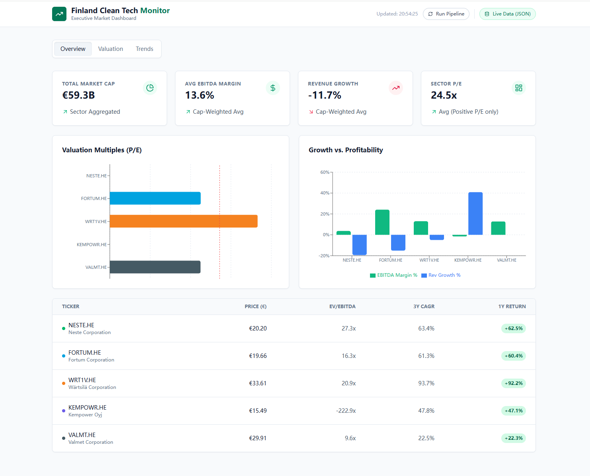

# 🇫🇮 Finnish Green Energy & Clean Tech Market Monitor

A consulting-grade full-stack analytics application tracking valuation anomalies and growth drivers in Finland's key renewable energy companies.



[]()
[]()
[](https://finnish-green-energy-monitor.vercel.app/)

## Project Overview

This application serves as a strategic analytics tool designed to bridge the gap between raw financial data and executive decision-making. Unlike static reports, this interactive dashboard provides a real-time view of how the market prices mature industrial players versus high-growth disruptors within the Finnish renewable energy sector.

The project simulates a real-world Strategy Consulting engagement, moving beyond simple data visualization to offer specific investment insights. It features a dual-mode architecture that allows users to toggle between a "Snapshot Mode" for reliable instant demonstrations and a "Live Mode" that connects to a local Python pipeline for real-time market analysis.

## Executive Summary & Insights

Current market data reveals a distinct bifurcation in the Finnish Clean Tech sector. Mature heavyweights like **Fortum** and **Valmet** are currently trading at historical discounts, effectively acting as defensive yield plays with EV/EBITDA multiples significantly below the sector average.

Conversely, growth-stage entrants like **Kempower** command significant premiums, pricing in aggressive future market share despite current profitability volatility. Structural headwinds are also visible, with **Neste** facing margin compression due to rising feedstock costs in the renewable diesel market, while **Wärtsilä** has successfully pivoted towards higher-margin service revenues.

*Full detailed analysis is available in the [docs/executive_summary.md](docs/executive_summary.md).*

## Technical Architecture

Built on a modern full-stack architecture, the application utilizes a **React (Vite)** frontend for responsive data visualization, powered by Recharts and Tailwind CSS to ensure a professional, clean UI.

The backend relies on a **Python Flask** server that orchestrates a robust ETL pipeline. This pipeline leverages **Pandas** and **yfinance** to extract, clean, and normalize real-time market data. A key engineering challenge was ensuring data reliability; the system implements automatic retry logic, caching mechanisms, and concurrency handling to resolve common API rate limits and Windows file locking issues.

### Directory Structure

The codebase is organized into two primary domains: `dashboard` contains the React frontend logic and visualization components, while `pipeline` houses the Python ETL scripts and Flask API server. Documentation and screenshots are maintained in the `docs` directory.

## How to Run Locally

This application is designed to be flexible. It can run in **Snapshot Mode** (Frontend only) for quick reviews, or **Live Mode** (Full Stack) for real-time data fetching.

### Prerequisites
* Node.js (v16+)
* Python (v3.9+)

### 1. Start the Dashboard (Frontend)
Navigate to the dashboard directory and install dependencies. This will launch the application in Snapshot Mode by default.

```bash
cd dashboard
npm install
npm run dev